---
tags:
  - architecture
  - depth-anything-v3
  - multi-view
  - streaming
  - 3d-reconstruction
status: planning
---

# System Architecture

## End-to-end pipeline

```text
Calibrated RGB camera
    → newest-frame capture queue
    → select frames at approximately 2 Hz during slow motion
    → assemble overlapping DA3 window
    → relative depth + confidence + w2c poses + intrinsics
    → confidence-filtered local colored cloud
    → align shared frames to the global map with Sim(3)
    → append only new-frame geometry
    → bound, display, log, and export
```

The system uses direct point-cloud accumulation. DA3 supplies coherent geometry and camera poses inside a window; [[Window Alignment and Mapping]] joins independent window coordinate frames.

```mermaid
flowchart LR
    Camera["Calibrated RGB camera"] --> Capture["Capture and smooth preview"]
    Capture --> Queue["Newest-frame queue<br/>bounded"]
    Queue --> Select["Slow frame selection<br/>approximately 2 Hz"]
    Select --> Assemble["Overlapping DA3 window"]
    Assemble --> Pending["Pending-window queue<br/>maximum one"]
    Pending --> Infer["DA3 Small inference<br/>one active window"]
    Infer --> Validate["Output validation and<br/>confidence filtering"]
    Validate --> Align["Shared-frame Sim(3)<br/>alignment gates"]
    Align -->|accepted| Commit["Atomic map commit<br/>new-frame geometry only"]
    Align -->|rejected| Preserve["Preserve last accepted<br/>map and overlap"]
    Commit --> Bound["Consolidate and enforce<br/>30-window / 1M-point bounds"]
    Bound --> Viewer["Independent live viewer"]
    Bound --> Artifacts["PLY, trajectory,<br/>telemetry, and logs"]
```



The diagram emphasizes the two bounded queues, the single active inference, and the acceptance boundary. A rejection follows the preserve-state path and never reaches the map commit.

## Window state

The primary configuration uses:

```text
window A = [f0, f1, f2, f3]
window B = [f2, f3, f4, f5]
```

The accepted overlap `[f2, f3]` persists into the next inference. The 3-frame fallback retains its final two frames and advances by one new frame.

Track these states:

- **Candidate:** selected frame not yet committed to a window
- **Pending:** complete window waiting for inference
- **Predicted:** DA3 outputs passed structural validation
- **Aligned:** window passed every Sim(3) gate
- **Committed:** non-overlap points and poses were added to the global map
- **Rejected:** inference or alignment failed; no global state changed

## Acceptance transaction

A new window is committed atomically:

1. Validate every DA3 output.
2. Build confidence-filtered points.
3. Estimate and validate the global Sim(3).
4. Transform new points and camera poses.
5. Append non-overlap geometry.
6. Advance the accepted overlap.
7. Apply map bounds.
8. publish one viewer snapshot and log record.

If any step before commit fails, retain the last accepted overlap and global map. A rejected window adds neither geometry nor camera poses.

## Runtime stages and queues

1. **Capture:** maintain a responsive preview and timestamp frames.
2. **Selection:** sample candidates at approximately 2 Hz.
3. **Window assembly:** preserve accepted overlap and choose the newest required non-overlap frames.
4. **Inference:** run one DA3 window at a time.
5. **Alignment:** register the predicted window to global state.
6. **Mapping:** commit accepted new-frame geometry and enforce bounds.
7. **Display/export:** update after each accepted window without blocking capture.

Only one inference may be active. Bound the pending work to one not-yet-started window. Before inference begins, stale non-overlap candidates may be replaced by newer frames; accepted overlap frames may not be replaced.

## Core data records

### Selected frame

- Unique frame identifier
- Capture timestamp
- Undistorted RGB image or durable file reference
- Camera-calibration identifier
- Selection order

### Window prediction

- Window identifier and ordered frame identifiers
- Overlap and new-frame membership
- Locked inference configuration
- Processed RGB
- Relative depth and confidence
- Intrinsics and world-to-camera extrinsics
- Inference status, latency, and peak memory

### Alignment result

- Source and target window identifiers
- Shared frame identifiers
- Correspondence and inlier counts
- Inlier ratio and median residual
- Sim(3) scale, rotation, and translation
- Accepted status or rejection reason

### Global map state

- Accepted-window count
- Accumulated colored point cloud
- Global camera trajectory
- Accepted overlap-frame geometry
- Internal-to-metric scale, when available
- Consolidation and point-cap events

## Failure behavior

- **Capture failure:** log and wait for a new frame.
- **Invalid DA3 output:** reject the window and keep the accepted overlap.
- **Out-of-memory failure:** stop inference, record the failure, and apply the fallback decision in [[Jetson Platform and Feasibility]].
- **Alignment rejection:** discard the predicted window and wait for replacement new frames.
- **Viewer failure:** continue mapping if possible and log the display failure.
- **Export failure:** preserve in-memory state and report the failed artifact.

## Runtime artifacts

Each run creates a unique results directory containing:

- Frozen configuration and software versions
- Camera-calibration identifier
- Selected frame identifiers and timestamps
- Window membership and overlap identifiers
- Retained diagnostic DA3 outputs
- Inference status, latency, and peak memory
- Sim(3) status and quality metrics
- Accepted and rejected window counts
- Queue and per-stage timings
- `tegrastats` telemetry
- Raw relative and optional metric-scaled trajectories
- Raw relative and optional metric-scaled PLY clouds
- Map-bound events
- Summary metrics and annotated screenshots

## Related notes

- [[DA3 Model and Outputs]]
- [[Window Alignment and Mapping]]
- [[Camera and Data Collection]]
- [[Deployment Roadmap]]
